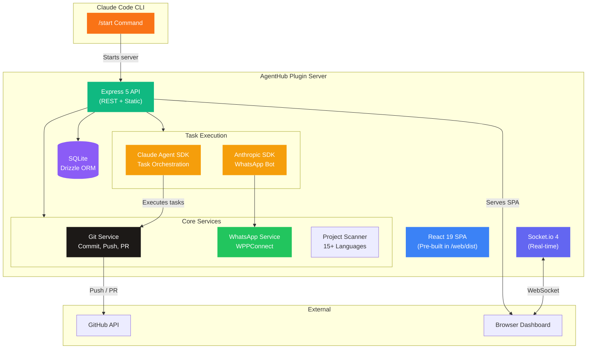
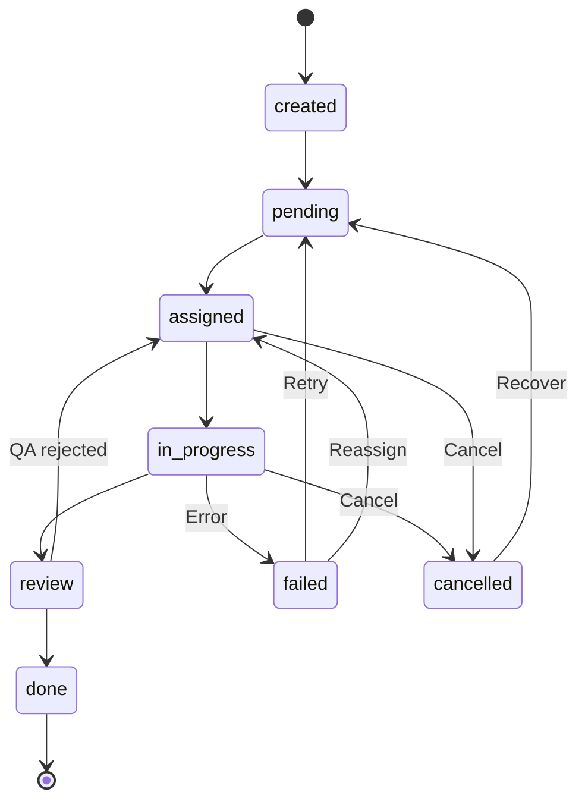

<div align="center">

# AgentHub Plugin

**AI development orchestration as a Claude Code plugin — 8 agents, task execution engine, WhatsApp integration, all running locally.**

[](https://typescriptlang.org)
[](https://nodejs.org)
[](server/src/e2e.test.ts)
[](#license)

[Features](#-features) · [Architecture](#-architecture) · [Quick Start](#-quick-start) · [Tech Stack](#-tech-stack) · [API Reference](#-api-reference)

</div>

---

## What is AgentHub Plugin?

AgentHub Plugin brings **AI-powered development orchestration** directly into Claude Code as a slash command. Run `/start` and get a full-featured dashboard with 8 specialized AI agents, project management, task execution with enforced state machine, GitHub integration for auto-commit/PR, WhatsApp messaging, and real-time analytics — all running locally on your machine. No cloud, no auth, no external dependencies.

Think of it as your own **AI dev team** — available inside any Claude Code session.

---

## Features

| Category | What you get |
|---|---|
| **8 AI Agents** | Architect, Tech Lead, Frontend Dev, Backend Dev, QA, Doc Writer, Team Lead, Support — pre-configured with roles and system prompts |
| **Task Execution Engine** | Claude Agent SDK orchestrates task execution with full lifecycle management |
| **Project Management** | Import local repos, clone from GitHub, or create new projects with tech stack selection (17 technologies) |
| **Task State Machine** | Enforced transitions with 65 validated scenarios — 16 valid, 40 invalid blocked, 8 no-op, 1 field update |
| **GitHub Integration** | Connect via Personal Access Token for auto-commit, push, and PR creation on task completion |
| **Agent Memories** | Persistent learnings accumulated during execution, injected into agent context |
| **Documentation Editor** | Built-in markdown editor with auto-generated API docs (51 endpoints) |
| **Git Dashboard** | Status, config, init, sync — all from the project settings UI |
| **File Browser** | Browse project files and read content with path traversal protection |
| **Claude Usage Widget** | Opus 5h rolling, Sonnet 7d, All models 7d with cache fallback |
| **WhatsApp Integration** | Direct messaging via @wppconnect-team/wppconnect with auto-reconnect |
| **Real-time Updates** | Socket.io WebSocket for live task progress and dashboard stats |
| **Factory Reset** | Clean slate option in Settings — preserves agent configurations |
| **Auto-login** | Detects 401 token expiry and triggers `claude login` automatically |
| **102 E2E Tests** | Comprehensive test suite covering all endpoints and state transitions |

---

## Architecture



### How the pieces fit together

| Component | Role | Tech |
|---|---|---|
| **Plugin Command** | `/start` — launches the server and opens the dashboard | Claude Code Plugin SDK |
| **Express Server** | REST API (51 endpoints), static SPA serving, middleware pipeline | Express 5 + Socket.io 4 |
| **SQLite Database** | Projects, agents, tasks, messages, logs, docs, integrations | better-sqlite3 + Drizzle ORM |
| **React Dashboard** | SPA with kanban, analytics, settings, file browser, docs editor | React 19 + Tailwind CSS 4 + Zustand |
| **Task Execution** | Agent-driven task orchestration with tool use | Claude Agent SDK |
| **WhatsApp Bot** | Messaging integration with QR code pairing | @wppconnect-team/wppconnect |
| **Git Service** | Branch management, commits, push, PR creation via GitHub API | `execFile` (injection-safe) |

---

## Quick Start

### Prerequisites

| Requirement | Version |
|---|---|
| Claude Code CLI | Authenticated (`claude login`) |
| Node.js | 18+ |

### Install & Run

```bash
# Install the plugin
claude plugins install agenthub

# Inside any Claude Code session, run:
/start
```

That's it. The plugin starts a local Express server, seeds 8 AI agents into SQLite, and opens the dashboard in your browser.

---

## Tech Stack

<div align="center">

| Layer | Technology |
|:---:|:---:|
| **Server** | Express 5, Socket.io 4, Node.js 18+ |
| **Database** | SQLite via better-sqlite3 + Drizzle ORM |
| **Frontend** | React 19, Vite, Tailwind CSS 4, Zustand (pre-built in `server/web/dist`) |
| **AI — Tasks** | Claude Agent SDK for autonomous task execution |
| **AI — WhatsApp** | Anthropic SDK for conversational bot |
| **WhatsApp** | @wppconnect-team/wppconnect with auto-reconnect |
| **Tests** | Vitest — 102 E2E tests |
| **Security** | `execFile` only, parameterized queries, path traversal protection |

</div>

---

## Default Agents

<div align="center">

| Agent | Role | Model | Thinking Tokens |
|:---:|:---:|:---:|:---:|
| **Architect** | `architect` | Claude Opus 4.6 | 32K |
| **Tech Lead** | `tech_lead` | Claude Sonnet 4.6 | 16K |
| **Frontend Dev** | `frontend_dev` | Claude Sonnet 4.6 | — |
| **Backend Dev** | `backend_dev` | Claude Sonnet 4.6 | — |
| **QA Engineer** | `qa` | Claude Sonnet 4.6 | — |
| **Doc Writer** | `doc_writer` | Claude Sonnet 4.6 | — |
| **Team Lead** | `receptionist` | Claude Haiku 4.5 | — |
| **Support** | `support` | Claude Opus 4.6 | 65K |

</div>

---

## Task State Machine



**65 transition scenarios validated** — 16 valid transitions, 40 invalid transitions blocked, 8 no-op transitions handled gracefully, 1 field update on `done` status.

---

## API Reference

51 endpoints organized by domain:

| Group | Endpoints | Description |
|---|:---:|---|
| **Projects** | 7 | CRUD, import, create with tech stack, disk deletion, GitHub repos |
| **Tasks** | 6 | CRUD, status transitions (enforced state machine), audit logs, execution |
| **Agents** | 5 | CRUD, context with memories, memory management |
| **Docs** | 5 | Documentation CRUD, auto-generated API reference |
| **Git** | 6 | Status, init, sync, config, branch operations, GitHub integration |
| **Files** | 2 | File tree browsing, content reader with path validation |
| **System** | 6 | Health check, Claude usage, Claude token status, scanner, factory reset, settings |
| **Integrations** | 8 | WhatsApp connect/disconnect/status/send, Telegram config, GitHub PAT |
| **Analytics** | 6 | Dashboard stats, task trends, agent performance, cost tracking |

---

## Data Storage

All data is stored locally — nothing leaves your machine.

| Item | Path |
|---|---|
| SQLite Database | `~/.agenthub-local/db.sqlite` |
| Server Port | `~/.agenthub-local/port` |
| Server Logs | `~/.agenthub-local/server.log` |
| WhatsApp Tokens | `~/.agenthub-local/whatsapp-tokens/` |
| Created Projects | `~/Projects/` |

---

## Development

```bash
# Clone the repository
git clone https://github.com/JohnPitter/agenthub-plugin.git
cd agenthub-plugin/server

# Install dependencies
npm install

# Start the development server
npm run dev

# The dashboard opens at http://localhost:<port>
# Port is dynamically assigned and saved to ~/.agenthub-local/port
```

The frontend is pre-built in `server/web/dist/`. To rebuild it, use the AgentHub web project with `VITE_LOCAL_MODE=true`.

---

## Testing

```bash
cd server

# Start the server first (tests run against the live server)
npm run dev

# Run the full test suite
npm test
```

**102 E2E tests** covering:
- All 51 API endpoints (CRUD operations, error handling, edge cases)
- Task state machine (65 transition scenarios)
- Project lifecycle (create, import, delete with disk cleanup)
- Agent management (default seeding, custom agents, memories)
- Git operations (init, status, sync)
- System endpoints (health, usage, factory reset)

---

## CI/CD

Three GitHub Actions workflows:

| Workflow | Trigger | What it does |
|---|---|---|
| **CI** | Push / PR | Install, build, run 102 E2E tests |
| **Release** | Tag push | Build, test, create GitHub Release |
| **Security** | Schedule / PR | `npm audit`, dependency vulnerability scan |

---

## Project Structure

```
agenthub-plugin/
├── plugins/agenthub/
│   ├── commands/start.md              # /start slash command definition
│   ├── skills/agenthub-context.md     # Context skill for AI assistance
│   └── README.md                      # Plugin marketplace description
├── server/
│   ├── src/
│   │   ├── index.ts                   # Express 5 server + Socket.io setup
│   │   ├── db.ts                      # SQLite schema + Drizzle ORM + migrations
│   │   ├── seed.ts                    # 8 default agents with system prompts
│   │   ├── e2e.test.ts                # 102 E2E tests (Vitest)
│   │   ├── routes/
│   │   │   ├── projects.ts            # Project CRUD + disk deletion
│   │   │   ├── tasks.ts               # Task CRUD + state machine
│   │   │   ├── agents.ts              # Agent CRUD + memories
│   │   │   ├── files.ts               # File tree + content reader
│   │   │   └── integrations.ts        # WhatsApp / Telegram endpoints
│   │   └── lib/
│   │       ├── claude-token.ts        # Reads ~/.claude/.credentials.json
│   │       ├── scanner.ts             # Local project detection (15+ languages)
│   │       └── whatsapp-service.ts    # WPPConnect WhatsApp client
│   ├── web/dist/                      # Pre-built React 19 SPA
│   ├── package.json
│   └── tsconfig.json
├── .github/workflows/                 # CI, Release, Security workflows
└── README.md
```

---

## Contributing

Contributions are welcome! Please follow these guidelines:

1. **Fork** the repository and create a feature branch
2. **Follow** the existing code style — TypeScript strict mode, 2-space indentation
3. **Test** your changes — ensure all 102 E2E tests pass (`npm test`)
4. **Build** successfully — `npm run build` must complete without errors
5. **Submit** a pull request with a clear description of the changes

### Development Principles

- Routes delegate to services — no business logic in route handlers
- All database queries use Drizzle ORM parameterized queries
- Git operations use `execFile` (never `exec`) with args as arrays
- File operations validate paths against traversal attacks
- Every state transition is validated by the task state machine

---

## License

MIT — see [LICENSE](LICENSE) for details.

---

<div align="center">

**Built with TypeScript and Claude by [@JohnPitter](https://github.com/JohnPitter)**

</div>
