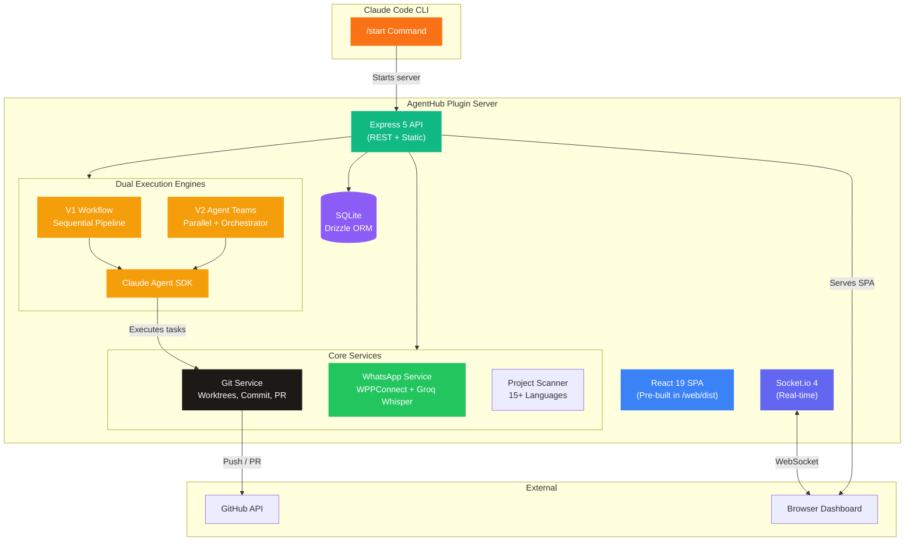
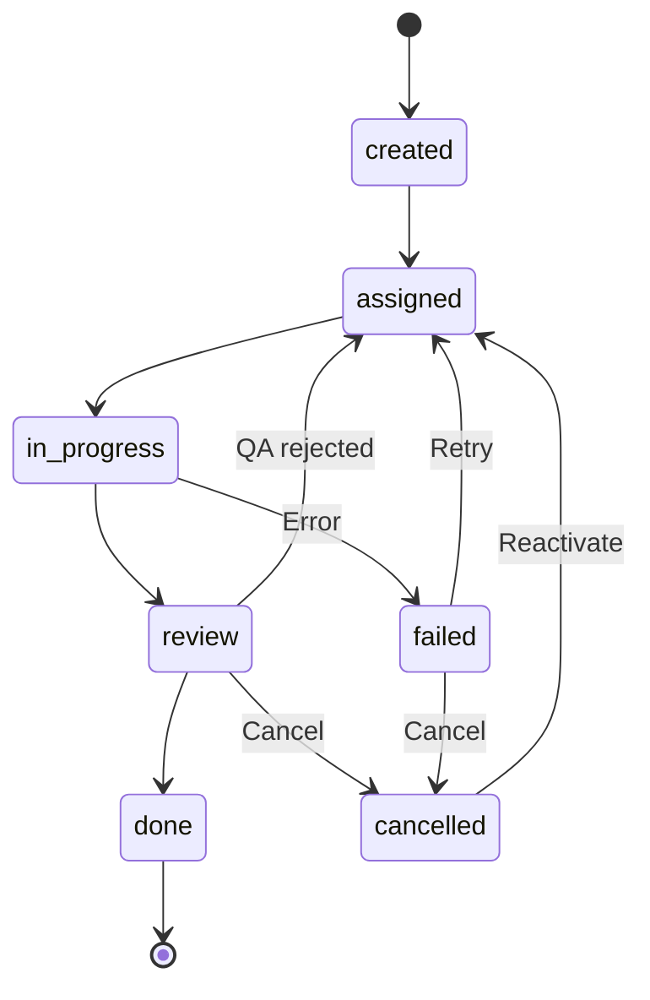

<div align="center">

# AgentHub Plugin

**AI development orchestration as a Claude Code plugin — 8 agents, dual execution engines (V1 Workflow + V2 Agent Teams), WhatsApp integration, all running locally.**

[](https://typescriptlang.org)
[](https://nodejs.org)
[](server/src/e2e.test.ts)
[](#license)

[Features](#-features) · [Architecture](#-architecture) · [Quick Start](#-quick-start) · [Tech Stack](#-tech-stack) · [API Reference](#-api-reference)

</div>

---

## What is AgentHub Plugin?

AgentHub Plugin brings **AI-powered development orchestration** directly into Claude Code as a slash command. Run `/start` and get a full-featured dashboard with 8 specialized AI agents, project management, task execution with enforced state machine, GitHub integration for auto-commit/PR, WhatsApp messaging, and real-time analytics — all running locally on your machine. No cloud, no auth, no external dependencies.

Think of it as your own **AI dev team** — available inside any Claude Code session.

---

## Features

| Category | What you get |
|---|---|
| **8 AI Agents** | Architect (Opus), Tech Lead (Haiku), Frontend Dev, Backend Dev, QA (Opus), Doc Writer (Haiku), Team Lead (Haiku), Support (Opus) |
| **V1 Workflow Engine** | Sequential pipeline with customizable workflow editor — agents follow a defined chain |
| **V2 Agent Teams** | Parallel execution with intelligent orchestrator — Tech Lead triages, Architect plans, devs work simultaneously in isolated worktrees |
| **Execution Mode Toggle** | Switch between V1 and V2 on the Agents page — both engines coexist |
| **Project Management** | Import local repos, clone from GitHub, or create new projects with tech stack selection (17 technologies) |
| **Task State Machine** | Enforced transitions — created → assigned → in_progress → review → done (with retry, cancel, reject flows) |
| **Monorepo Support** | Automatic detection and scaffolding of monorepo structure (root package.json, docs/, README) |
| **GitHub Integration** | Connect via PAT for auto-commit with co-authors, push, and PR creation on task completion |
| **Team Insights** | Shared memory system — agents discover project-specific insights during execution and share with the team |
| **WhatsApp Integration** | Team Lead bot with audio transcription (Groq Whisper), task management, real-time status updates |
| **Real-time Updates** | Socket.io WebSocket for live task progress, phase tracking, agent activity — persists across page refresh |
| **Adaptive QA** | QA model scales with task complexity: Haiku (simple) → Sonnet (moderate) → Opus (complex) |
| **Task Logs** | Persistent execution logs in `~/.agenthub-local/logs/` for troubleshooting |
| **Auto-login** | Detects 401 token expiry and triggers `claude login` automatically |
| **Factory Reset** | Clean slate option in Settings — preserves agent configurations |
| **149 E2E Tests** | Comprehensive test suite: 102 V1 + 47 V2 covering all endpoints and flows |

---

## Architecture



### How the pieces fit together

| Component | Role | Tech |
|---|---|---|
| **Plugin Command** | `/start` — launches the server and opens the dashboard | Claude Code Plugin SDK |
| **Express Server** | REST API (55+ endpoints), static SPA serving, middleware pipeline | Express 5 + Socket.io 4 |
| **SQLite Database** | Projects, agents, tasks, messages, logs, docs, integrations, memories | better-sqlite3 + Drizzle ORM |
| **React Dashboard** | SPA with kanban, analytics, settings, file browser, workflow editor | React 19 + Tailwind CSS 4 + Zustand |
| **V1 Executor** | Sequential workflow — agents follow a configurable chain | Claude Agent SDK |
| **V2 Executor** | Agent Teams — orchestrator triages, agents work in parallel worktrees | Claude Agent SDK + Worktree Manager |
| **Orchestrator** | Triage (Haiku) analyzes tasks, decides complexity and agent allocation | Anthropic SDK |
| **WhatsApp Bot** | Team Lead with audio transcription, task management, real-time notifications | WPPConnect + Groq Whisper |
| **Git Service** | Branch management, worktrees, commits, push, PR creation | `execFile` (injection-safe) |

---

## V2 Agent Teams Flow

```
Task assigned
    ↓
Triage (Tech Lead - Haiku, ~5s)
    → Classifies: simple | moderate | complex
    → Creates execution plan with phases
    ↓
Planning (Architect - Opus) [optional]
    → Creates docs/, package.json, README
    → Monorepo scaffolding if needed
    ↓
Implementation (Devs - Sonnet) [parallel]
    → Each agent in isolated git worktree
    → Backend Dev + Frontend Dev simultaneously
    ↓
Merge (automatic)
    → Commits worktree changes
    → Merges into task branch → main branch
    ↓
QA Review (adaptive model)
    → simple: Haiku | moderate: Sonnet | complex: Opus
    → Approves or rejects with feedback
    ↓
Done → Auto-commit with co-authors + PR
```

---

## Quick Start

### Prerequisites

| Requirement | Version |
|---|---|
| Claude Code CLI | Authenticated (`claude login`) |
| Node.js | 18+ |

### Install & Run

```bash
# Install the plugin
claude plugins install agenthub

# Inside any Claude Code session, run:
/start
```

That's it. The plugin starts a local Express server, seeds 8 AI agents into SQLite, and opens the dashboard in your browser.

---

## Tech Stack

<div align="center">

| Layer | Technology |
|:---:|:---:|
| **Server** | Express 5, Socket.io 4, Node.js 18+ |
| **Database** | SQLite via better-sqlite3 + Drizzle ORM |
| **Frontend** | React 19, Vite, Tailwind CSS 4, Zustand |
| **AI — Tasks** | Claude Agent SDK for autonomous task execution |
| **AI — Triage** | Anthropic SDK for orchestrator (Haiku) |
| **AI — WhatsApp** | Anthropic SDK for conversational bot (Haiku) |
| **Audio** | Groq Whisper for WhatsApp audio transcription |
| **WhatsApp** | @wppconnect-team/wppconnect with auto-reconnect |
| **Tests** | Vitest — 149 E2E tests (102 V1 + 47 V2) |
| **Security** | `execFile` only, parameterized queries, path traversal protection |

</div>

---

## Default Agents

<div align="center">

| Agent | Role | Model | Purpose |
|:---:|:---:|:---:|:---|
| **Architect** | `architect` | Opus | Plans architecture, creates docs, scaffolds monorepo |
| **Tech Lead** | `tech_lead` | Haiku | Triages tasks, coordinates workflow (V1), fast analysis |
| **Frontend Dev** | `frontend_dev` | Sonnet | Implements UI components, pages, styling |
| **Backend Dev** | `backend_dev` | Sonnet | Implements API, database, server logic |
| **QA Engineer** | `qa` | Opus | Reviews code quality, validates features |
| **Doc Writer** | `doc_writer` | Haiku | Generates docs, README, API reference — writes files |
| **Team Lead** | `receptionist` | Haiku | WhatsApp bot, task coordination |
| **Support** | `support` | Opus | Critical infrastructure, DevOps, escalation |

</div>

---

## Task State Machine



---

## Data Storage

All data is stored locally — nothing leaves your machine.

| Item | Path |
|---|---|
| SQLite Database | `~/.agenthub-local/local.db` |
| Server Port | `~/.agenthub-local/port` |
| Workflow Config | `~/.agenthub-local/workflow.json` |
| Execution Logs | `~/.agenthub-local/logs/task-*.log` |
| WhatsApp Tokens | `~/.agenthub-local/whatsapp-tokens/` |
| Created Projects | `~/Projects/` |
| Task Workspaces | `~/Projects/.agenthub-tasks/` |

---

## Development

```bash
# Clone the repository
git clone https://github.com/JohnPitter/agenthub-plugin.git
cd agenthub-plugin

# Server
cd server && npm install && npm run dev

# Frontend (separate terminal)
cd web && npm install && npm run dev
```

### Testing

```bash
cd server

# Start the server first (tests run against the live server)
npm run dev

# Run V1 tests
DISABLE_AUTO_EXECUTE=1 npx vitest run src/e2e.test.ts

# Run V2 tests
DISABLE_AUTO_EXECUTE=1 npx vitest run src/e2e-v2.test.ts
```

---

## Project Structure

```
agenthub-plugin/
├── plugins/agenthub/
│   ├── commands/start.md              # /start slash command
│   └── skills/agenthub-context.md     # Context skill
├── server/
│   ├── src/
│   │   ├── index.ts                   # Express 5 + Socket.io server
│   │   ├── db.ts                      # SQLite schema + Drizzle ORM
│   │   ├── seed.ts                    # 8 default agents + workflow seeding
│   │   ├── e2e.test.ts                # 102 V1 E2E tests
│   │   ├── e2e-v2.test.ts             # 47 V2 E2E tests
│   │   ├── routes/
│   │   │   ├── tasks.ts               # Task CRUD + state machine + V1/V2 switch
│   │   │   ├── projects.ts            # Project CRUD + disk deletion
│   │   │   ├── agents.ts              # Agent CRUD + memories
│   │   │   ├── files.ts               # File tree + content reader
│   │   │   └── integrations.ts        # WhatsApp / GitHub / Groq endpoints
│   │   └── lib/
│   │       ├── task-executor.ts       # V1 sequential workflow engine
│   │       ├── task-executor-v2.ts    # V2 Agent Teams engine
│   │       ├── orchestrator.ts        # Triage + merge review + QA routing
│   │       ├── worktree-manager.ts    # Git worktree isolation
│   │       ├── execution-state.ts     # Server-side state persistence
│   │       ├── task-logger.ts         # Persistent file logging
│   │       ├── whatsapp-service.ts    # WPPConnect + Groq Whisper
│   │       └── scanner.ts            # Local project detection
│   └── web/dist/                      # Pre-built React SPA
├── web/                               # Frontend source (React + Vite)
│   ├── src/
│   │   ├── routes/                    # Pages: tasks, agents, projects, settings
│   │   ├── components/                # UI components
│   │   ├── stores/                    # Zustand state management
│   │   └── shared/                    # Shared types + events
├── docs/plans/                        # Architecture & design documents
├── .github/workflows/                 # CI, Release, Security
└── README.md
```

---

## License

MIT

</div>
